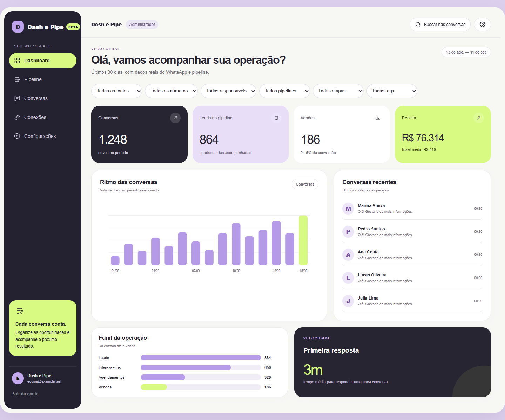

# Atualização visual

Interface inspirada nas referências: navegação grafite, cartões claros e arredondados, detalhes lilás e verde-lima. O tema está limitado ao workspace autenticado. Dashboard, pipeline, conversas, conexões e configurações compartilham o novo tratamento visual.

O dashboard usa barras para volume diário, filtros com nomes acessíveis e links das conversas recentes para a busca da caixa de entrada. O cabeçalho oferece acesso funcional à busca e às configurações. A navegação móvel mantém os cinco destinos visíveis.

A imagem usa dados fictícios em um ambiente de verificação separado. Nenhuma autenticação simulada ou fixture foi adicionada ao aplicativo.

Validações:
- TypeScript, ESLint e build de produção Next.js aprovados.
- Dashboard inspecionado em 1440px e 390px, sem transbordamento horizontal.
- Seleção de fonte atualiza a URL e preserva o filtro selecionado.
- Estado vazio do gráfico, conversas e funil verificado.
- Não foi validada a integração autenticada com Supabase ou o envio de mensagens reais.
